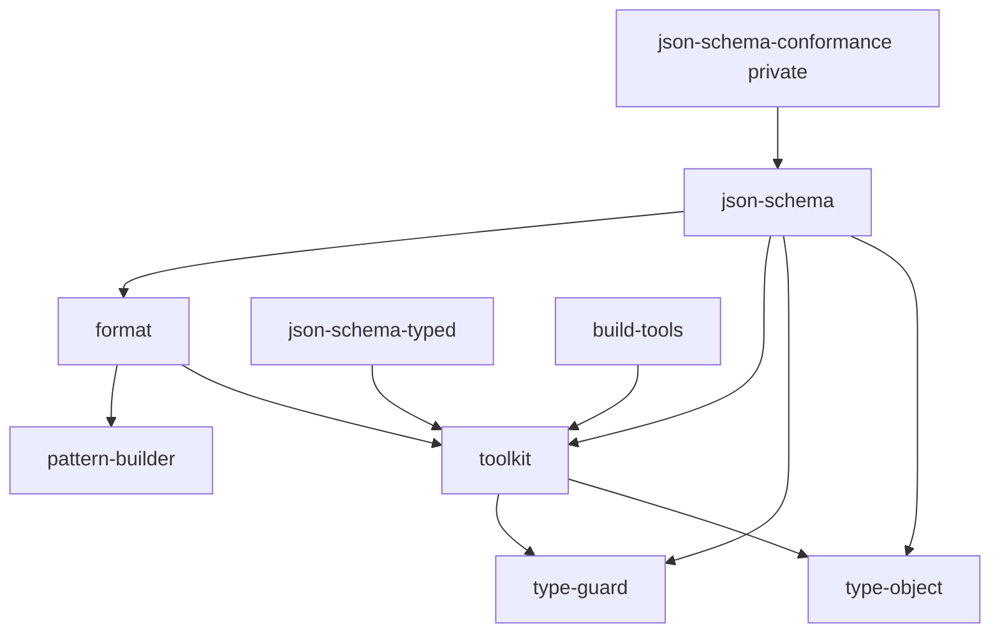

# 저장소 구조

- Last verified: 2026-08-04
- Verified against: `pnpm-workspace.yaml`, `libs/*/package.json`, `tools/*/package.json`

`new-wheels`는 TypeScript 라이브러리와 이를 지원하는 도구를 관리하는 pnpm workspace입니다. `libs/*`와 일부 `tools/*`는 공개 npm 패키지이며, 저장소 검증과 적합성 테스트처럼 배포하지 않는 도구는 private 패키지로 분리합니다.

## 영역

### `libs/*`

독립적으로 배포되는 공개 npm 패키지입니다. 각 패키지는 가능한 한 동일한 구조를 따릅니다.

```text
libs/<package>/
├── src/                 # 구현과 테스트
├── docs/                # API Documenter 생성 결과
├── README.md            # 영문 사용자 문서
├── README_KR.md         # 한글 사용자 문서
├── CHANGELOG.md         # Changesets가 관리하는 변경 기록
└── package.json
```

### `tools/*`

저장소의 빌드와 설정을 지원합니다.

- [`@imhonglu/build-tools`](../../tools/build-tools/README.md): 빌드 후 ESM 출력을 CommonJS로 변환하는 공개 패키지입니다.
- [`@imhonglu/cli-tools`](../../tools/cli-tools/README.md): 저장소 검증에 사용하는 private CLI 패키지입니다.
- [`@imhonglu/configs`](../../tools/configs/README.md): TypeScript와 API Extractor의 공유 설정을 제공하는 공개 패키지입니다.
- [`@imhonglu/json-schema-conformance`](../../tools/json-schema-conformance/README.md): 고정한 upstream fixture에서 JSON Schema 적합성 테스트를 생성하고 실행하는 private 패키지입니다.

## 런타임 의존 방향

아래 화살표는 왼쪽 패키지가 오른쪽 workspace 패키지를 `dependencies`로 사용한다는 뜻입니다. 정확한 기준은 각 `package.json`이며, 이 그림은 변경 영향을 탐색하기 위한 현재 상태 요약입니다. 런타임 workspace 의존성이 없는 패키지는 간선을 표시하지 않습니다.



workspace 런타임 간선을 추가·변경·제거할 때는 [의존성 관리](../guides/managing-dependencies.md)에 따라 선언과 현재 그래프를 함께 갱신합니다. 의존 대상의 공개 계약을 변경하면 직접 의존 패키지까지 빌드와 테스트 범위를 확장하고, 구체적인 검증은 [테스트와 검증](../guides/testing-and-validation.md)을 따릅니다.

## 진입점 경계

- 라이브러리와 코드 API는 패키지의 `src/index.ts`에서 명시적으로 노출합니다.
- 공개 도구의 CLI와 설정 진입점은 `package.json`의 `bin`과 `exports`에서 명시적으로 노출합니다.
- TypeScript CLI 소스는 `src/bin`, 실행 진입점은 빌드된 `dist/bin`으로 통일합니다. 구현과 테스트 방법은 [CLI 도구 작성](../guides/writing-cli-tools.md)을 따릅니다.
- 공개 라이브러리의 외부 적합성 fixture와 생성기는 private 도구 패키지가 소유합니다. 선택 배경은 [ADR 0002](../decisions/0002-separate-json-schema-conformance-tooling.md)에 기록되어 있습니다.
