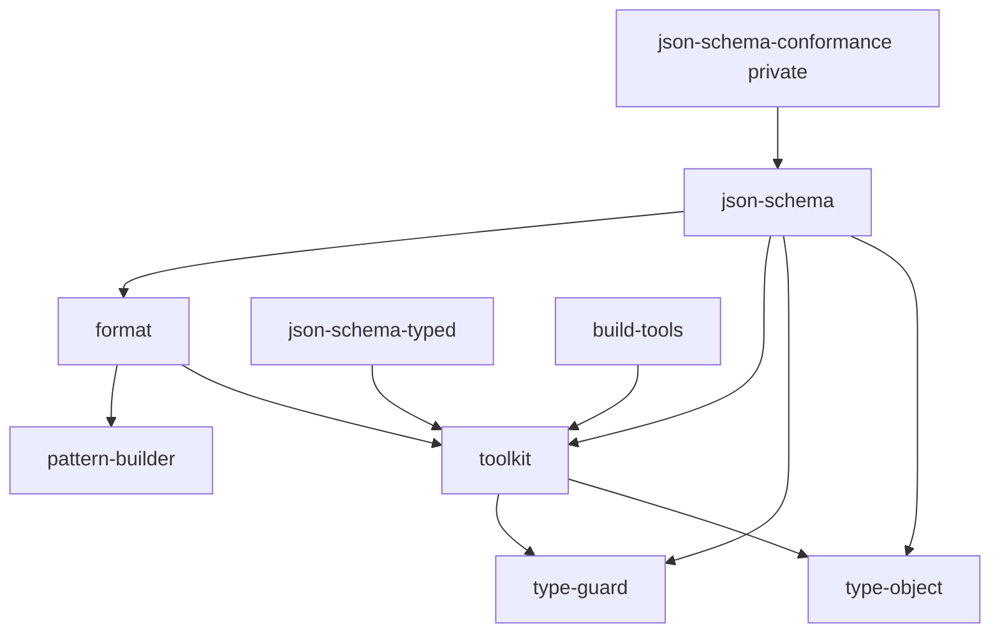

# 저장소 구조

- Last verified: 2026-08-05
- Verified against: `pnpm-workspace.yaml`, `tools/configs/tsdown.config.js`, `libs/*/package.json`, `tools/*/package.json`, `**/tsdown.config.ts`

`new-wheels`는 TypeScript 라이브러리와 이를 지원하는 도구를 관리하는 pnpm workspace입니다. `libs/*`와 일부 `tools/*`는 공개 npm 패키지이며, 저장소 검증과 적합성 테스트처럼 배포하지 않는 도구는 private 패키지로 분리합니다.

## 영역

### `libs/*`

독립적으로 배포되는 공개 npm 패키지입니다. 각 패키지는 가능한 한 동일한 구조를 따릅니다.

```text
libs/<package>/
├── src/                 # 구현과 테스트
├── docs/                # API Documenter 생성 결과
├── README.md            # 영문 사용자 문서
├── README_KR.md         # 한글 사용자 문서
├── CHANGELOG.md         # Changesets가 관리하는 변경 기록
└── package.json
```

### `tools/*`

저장소의 빌드와 설정을 지원합니다.

- [`@imhonglu/build-tools`](../../tools/build-tools/README.md): 코드 생성을 위한 TypeScript 컴파일러 유틸리티를 제공하는 공개 패키지입니다.
- [`@imhonglu/cli-tools`](../../tools/cli-tools/README.md): 저장소 검증에 사용하는 private CLI 패키지입니다.
- [`@imhonglu/configs`](../../tools/configs/README.md): TypeScript, API Extractor와 빌드 도구의 공유 설정을 제공하는 공개 패키지입니다.
- [`@imhonglu/json-schema-conformance`](../../tools/json-schema-conformance/README.md): 고정한 upstream fixture에서 JSON Schema 적합성 테스트를 생성하고 실행하는 private 패키지입니다.

## 런타임 의존 방향

아래 화살표는 왼쪽 패키지가 오른쪽 workspace 패키지를 `dependencies`로 사용한다는 뜻입니다. 정확한 기준은 각 `package.json`이며, 이 그림은 변경 영향을 탐색하기 위한 현재 상태 요약입니다. 런타임 workspace 의존성이 없는 패키지는 간선을 표시하지 않습니다.



workspace 런타임 간선을 추가·변경·제거할 때는 [의존성 관리](../guides/managing-dependencies.md)에 따라 선언과 현재 그래프를 함께 갱신합니다. 의존 대상의 공개 계약을 변경하면 직접 의존 패키지까지 빌드와 테스트 범위를 확장하고, 구체적인 검증은 [테스트와 검증](../guides/testing-and-validation.md)을 따릅니다.

## 빌드 경계

- 빌드 출력이 있는 workspace는 각 패키지의 `build` 스크립트만으로 산출물을 완성하며, 루트 `build`는 workspace 의존 관계를 고려해 이 스크립트들을 실행합니다.
- 공개 TypeScript 패키지는 가까운 `tsdown.config.ts`에서 `@imhonglu/configs/tsdown.config.js`의 unbundle 설정을 사용하고 소스별 ESM `.js`, CommonJS `.cjs`, 타입 선언 `.d.ts`와 소스 매핑 정보를 생성합니다. 기본 설정은 그대로 사용하고, 플랫폼이나 plugin 예외만 `mergeConfig`로 병합합니다. 컴파일과 같은 모듈 의미와 등록 부수 효과를 보존하기 위해 빌드 단계의 tree-shaking은 사용하지 않으며, `package.json#exports`가 산출물을 소비자 진입점으로 연결합니다.
- 루트와 workspace의 JavaScript 모듈 기준은 `package.json#type: module`입니다. 설정 파일과 ESM 산출물은 `.js`를 사용하고, CommonJS가 필요한 산출물만 `.cjs`로 명시합니다.
- 표준 데코레이터 변환이 필요한 `@imhonglu/format`만 가까운 tsdown 설정에서 SWC plugin을 추가합니다.
- private CLI 패키지는 가까운 tsdown 설정에서 Node.js용 ESM 실행 파일만 생성합니다. 실행 경계는 [CLI 도구 작성](../guides/writing-cli-tools.md)을 따릅니다.
- 빌드 설정과 manifest가 현재 실행 사실의 기준입니다. 출력 계약을 바꿀 때는 소비 방식, API 문서 입력과 package dry-run을 함께 검증합니다.

## 진입점 경계

- 라이브러리와 코드 API는 패키지의 `src/index.ts`에서 명시적으로 노출합니다.
- 공개 도구의 CLI와 설정 진입점은 `package.json`의 `bin`과 `exports`에서 명시적으로 노출합니다.
- TypeScript CLI 소스는 `src/bin`, 실행 진입점은 빌드된 `dist/bin`으로 통일합니다. 구현과 테스트 방법은 [CLI 도구 작성](../guides/writing-cli-tools.md)을 따릅니다.
- 공개 라이브러리의 외부 적합성 fixture와 생성기는 private 도구 패키지가 소유합니다. 선택 배경은 [ADR 0002](../decisions/0002-separate-json-schema-conformance-tooling.md)에 기록되어 있습니다.
