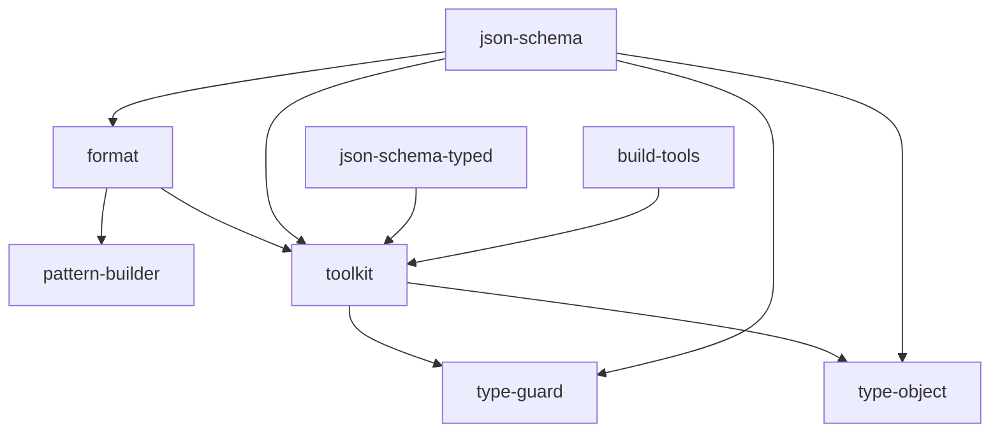

# 런타임 패키지 의존 관계

- Status: Active
- Last verified: 2026-07-21
- Verified against: `libs/*/package.json`, `tools/*/package.json`

아래 관계는 각 `package.json`의 `dependencies`를 기준으로 합니다. 개발 의존성과 런타임 의존성이 없는 `@imhonglu/cli-tools`, `@imhonglu/configs`는 표시하지 않습니다.

화살표는 “왼쪽 패키지가 오른쪽 패키지를 의존한다”는 뜻입니다.

## 변경 영향 확인

의존 대상 패키지의 공개 API를 변경하면 직접 의존하는 패키지의 빌드와 테스트도 확인합니다. Changesets는 `updateInternalDependencies: patch` 설정에 따라 필요한 의존 패키지의 버전을 연쇄 갱신할 수 있습니다.

이 문서는 현재 `package.json`을 기준으로 수동 관리합니다. 패키지 의존성이 변경되면 이 다이어그램도 같은 작업에서 갱신합니다.
