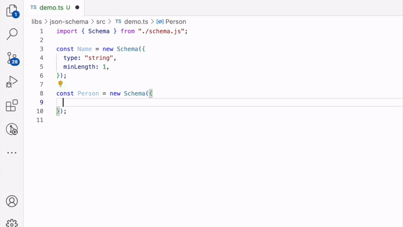

# @imhonglu/json-schema

[English](./README.md) | [한국어](./README_KR.md)

## Introduction

- A library that complies with JSON Schema 2020-12-draft specification
- Validated based on [JSON-Schema-test-suite](https://github.com/json-schema-org/JSON-Schema-Test-Suite)
- Supports **static type inference** based on schema definitions



## Table of Contents

- [Features](#features)
- [Implementation Status](#implementation-status)
- [Installation](#installation)
- [Usage](#usage)
- [Known Issues](#known-issues)
- [API Reference](#api-reference)

## Features

- [x] TypeScript static type checking support for schema definitions
- [x] Smart type inference
  - [x] Required/optional field inference based on `required` property
  - [x] Type inference for fields with `default` values / function type support
  - [x] Recursive type inference for nested objects
- [x] Class-based schema definition support
- [ ] Custom features
  - [ ] Schema validation message customization
  - [ ] Custom error handling
  - [ ] Validation rule extension support

## Implementation Status

Currently, 1,487 out of 1,563 test cases have passed (95.1%)

Excluded items:

- `defs`: Schema definition related tests, excluded as they are not related to validation
- `format`: Excluded as it belongs to the optional category

Unsupported items:

- `anchor`
- `refRemote`
- `vocabulary`
- `dynamicRef`
- `optional/anchor`
- `optional/dynamicRef`
- `optional/dependencies-compatibility`
- `optional/format/relative-json-pointer`
- `optional/format/json-pointer`

## Installation

```bash
npm install @imhonglu/json-schema
```

## Usage

### Basic Schema Definition

```ts
// address.ts
import { createSchemaClass } from "@imhonglu/json-schema";

export class Address extends createSchemaClass({
  type: "object",
  properties: {
    street: { type: "string" },
    city: { type: "string" },
    zip: { type: "string" },
  },
  // Define street property as required
  required: ["street"],
}) {}

// ✅ Type inference result:
// {
//   street: string;   // required
//   city?: string;    // optional
//   zip?: string;     // optional
// }
```

### Nested Schema

```ts
// person.ts
import { createSchemaClass } from "@imhonglu/json-schema";
import { Address } from "./address.js";

export class Person extends createSchemaClass({
  type: "object",
  properties: {
    name: { type: "string" },
    address: Address, // Nested Address schema
    createdAt: {
      type: "string",
      default: () => new Date().toISOString(),
    },
    // String field that allows null
    deletedAt: {
      type: ["string", "null"],
      default: null,
    },
  },
  required: ["name", "createdAt", "deletedAt"],
}) {}

// ✅ Type inference result:
// {
//   name: string;                // required
//   address?: Address;           // optional
//   createdAt: string;           // required
//   deletedAt: string | null;    // required
// }
```

### Usage with `new`

```ts
import { Person } from "./person.js";

// Create instance with object literal
const johnDoe = new Person({
  name: "John Doe",
  address: {
    street: "123 Main St",
    city: "Toronto",
    zip: "M5H 2N2",
  },
});

// ✅ Result:
// {
//   name: 'John Doe',
//   address: Address {
//     street: '123 Main St',
//     city: 'Toronto',
//     zip: 'M5H 2N2'
//   },
//   deletedAt: null
// }

// ✅ Property access
console.log(johnDoe.name);            // 'John Doe'
console.log(johnDoe.address?.street); // '123 Main St'
console.log(johnDoe.deletedAt);       // null

// ✅ Using directly created Address instance
const maryDoe = new Person({
  name: "Mary Doe",
  address: new Address({
    street: "456 Main St",
    city: "Toronto",
    zip: "M5H 2N2",
  }),
});
```

### Parsing with `parse`

The `parse` method creates a schema instance by parsing a string.
```ts
const person = Person.parse('{ "name": "John" }'); // Person
```

### Parsing with `safeParse`

You can safely parse using the `safeParse` method.

```ts
const person = Person.safeParse('{ "name": "John" }'); // SafeResult<Person>

if (person.success) {
  console.log(person.data); // Person
} else {
  console.error(person.error); // ValidationFailedError
}
```

### Serializing with `JSON.stringify`

The `toJSON` method is implemented, allowing serialization through `JSON.stringify`.

```ts
const person = new Person({ name: "John" });
const json = JSON.stringify(person); // '{"name":"John","deletedAt":null}'
```

## Known Issues

### Type Inference Limitations for Inline Schemas

There is an issue where type inference for the `required` property doesn't work properly for inline-defined sub-schemas.

For example:

```ts
class Person extends createSchemaClass({
  type: "object",
  properties: {
    name: { type: "string" },
    address: {
      type: "object",
      properties: {
        street: { type: "string" },
        city: { type: "string" },
        zip: { type: "string" },
      },
      required: ["street"], // This constraint is not properly applied
    },
  },
  required: ["name"],
}) {}

// ❌ No type error due to incorrect inference
const person = new Person({
  name: "John Doe",
  address: {}, // No type error despite street being required
});
```

### Solution: Separate into Independent Classes

To resolve this issue, sub-schemas should be defined as separate classes.

```ts
// ✅ Separate into independent class
class Address extends createSchemaClass({
  type: "object",
  properties: {
    street: { type: "string" },
    city: { type: "string" },
    zip: { type: "string" },
  },
  required: ["street"],
}) {}

class Person extends createSchemaClass({
  type: "object",
  properties: {
    name: { type: "string" },
    address: Address, // Reference Address class
  },
  required: ["name"],
}) {}

const person = new Person({
  name: "John Doe",
  address: {}, // ✅ Type error: street property is required
});
```

## API Reference

### Core API

- [Schema](./docs/json-schema.schema.md) - Base class for all schema types as an implementation of JSON Schema
- [createSchemaClass](./docs/json-schema.createschemaclass.md) - Creates a type-safe schema class from JSON Schema definition
- [InferSchemaInputType](./docs/json-schema.inferschemainputtype.md) - Infers input type from schema definition
- [InferSchemaType](./docs/json-schema.inferschematype.md) - Infers type from schema definition
- [InferSchema](./docs/json-schema.inferschema.md) - Infers schema type
- [ConstSchema](./docs/json-schema.constschema.md) - Defines a schema that allows only a single fixed value
- [EnumSchema](./docs/json-schema.enumschema.md) - Defines a schema that allows one of predefined values
- [TypeSchema](./docs/json-schema.typeschema.md) - Schema that defines basic JSON data types
- [SchemaVariant](./docs/json-schema.schemavariant.md) - Includes all schema types supported by the library

### JSON Schema Specification Types

- [JsonSchema](./docs/json-schema.jsonschema.md) - JSON Schema type including Object Schema and Boolean Schema types
- [ObjectSchema](./docs/json-schema.objectschema.md) - Object Schema
- [BooleanSchema](./docs/json-schema.booleanschema.md) - Boolean Schema
