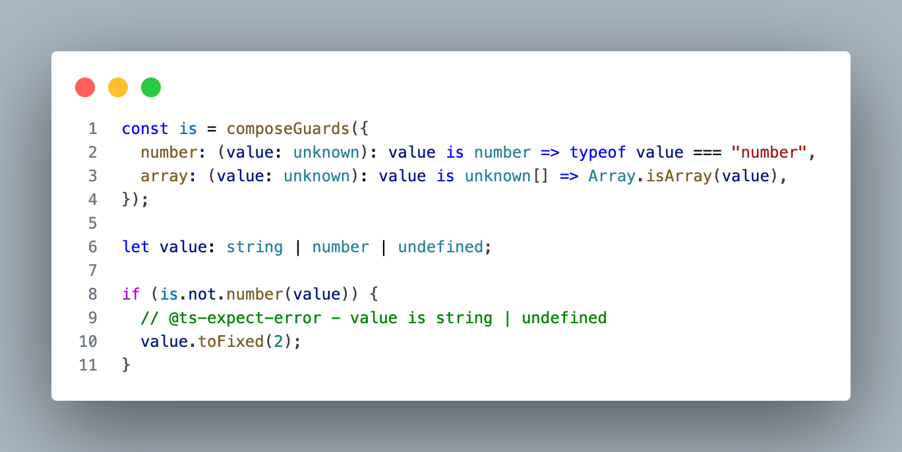

# @imhonglu/type-guard

[English](./README.md) | [한국어](./README_KR.md)

## Introduction

- 종속성 없이 사용할 수 있는 타입 가드 라이브러리입니다.
- Jest의 matcher 패턴에서 영감을 받아 체이닝 방식의 API를 제공합니다.
- `Proxy` 기반으로 동작하여 오버헤드를 최소화하고 타입 안전성을 보장합니다.



## Table of Contents

- [Installation](#installation)
- [Usage](#usage)
- [API Reference](#api-reference)

## Installation

```bash
npm install @imhonglu/type-guard
```

## Usage

`composeGuards` 함수를 사용하여 만들어진 타입 가드는 `not` 키를 사용하여 부정된 타입 가드를 얻을 수 있습니다.

자세한 용례는 [API Reference](#api-reference) 에서 확인할 수 있습니다.

```ts
import { composeGuards } from '@imhonglu/type-guard';

// 타입 가드 조합
const has = composeGuards({
	length: (value: unknown): value is object & { length: number } =>
		typeof value === "object" && value !== null && "length" in value,
});
// {
//   length: [Function];
//   not: {
//     length: [Function];
//   };
// }

let value: unknown[] | number | undefined;

if (has.length(value)) { ... } // value is unknown[]
if (has.not.length(value)) { ... } // value is number | undefined
```

## API Reference

- [composeGuards](./docs/type-guard.composeguards.md) - 타입 가드 조합
- [negateGuards](./docs/type-guard.negateguards.md) - 타입 가드 부정
- [negateGuard](./docs/type-guard.negateguard.md) - 단일 타입 가드 부정
